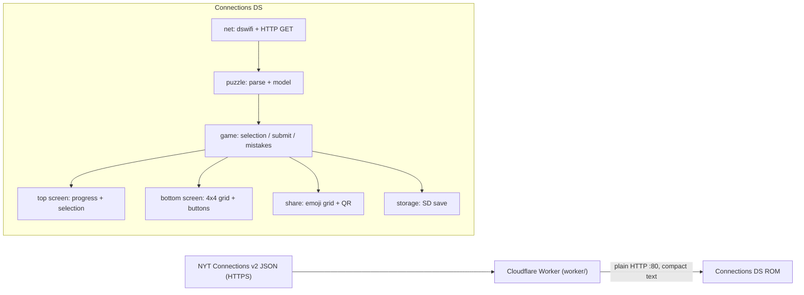

# NoYT Connections

A Nintendo DS(i) homebrew port of the New York Times **Connections** puzzle.
Group sixteen words into four hidden categories in four guesses, on real DS
hardware. It fetches the current daily puzzle over Wi-Fi (via a small companion
proxy), plays offline from a bundled puzzle when there's no connection, and lets
you share your result as a scannable **QR code**, Wordle-style.

> NYT puzzle content is copyrighted. This is a personal-use clone; it ships no
> NYT puzzle data beyond a single generic offline sample.

## Features

- **Dual-screen play.**
  - *Top screen:* title + date, mistakes remaining, the solved category bars
    stacked in the order you found them (with the answers revealed), and a live
    view of your current selection as you tap tiles.
  - *Bottom (touch) screen:* the 4×4 word grid plus a single row of icon
    buttons — Info, Settings (⚙), Sync (refresh), Shuffle, Deselect (✕),
    Submit (✓). When a game finishes it becomes a stats screen (played, win %,
    streak, best) with Info, Settings, Sync, Stats, and `Share`.
- **Real Connections rules:** pick 4, "one away" feedback when 3/4 match, four
  mistakes allowed, correct groups reveal and collapse the grid, win/loss, and a
  colored-square result grid for sharing.
- **Online sync** of the newest daily puzzle over DSi-mode WPA2 Wi-Fi.
- **Offline fallback** puzzle bundled in the ROM so it always boots into a game.
- **QR + text sharing:** renders a QR of your emoji result on the bottom screen
  and writes `share.txt` to the SD card.
- **Settings panel** (⚙, on both toolbars): toggle auto-sync on launch and
  confirm-before-submit, reset statistics, and jump into a **previous day's
  puzzle** as *practice* — the most recent day you haven't completed yet.
- **Practice / archive play:** past-date puzzles are clearly marked "Practice"
  and never affect your lifetime stats or streak; the archive jump automatically
  skips days you've already finished.
- **Save data** on SD: resume today's in-progress board, plus lifetime stats
  (played, wins, streak, max streak) and your preferences.
- **Sleep on lid close:** closing the hinge puts the console into low-power
  sleep and resumes exactly where you left off (RAM is retained), to save
  battery.

## Why a companion proxy?

The NYT endpoint (`https://www.nytimes.com/svc/connections/v2/<date>.json`) is
**HTTPS-only**, and the DS has no practical TLS stack. A tiny **Cloudflare
Worker** (in [`worker/`](worker/)) does the HTTPS fetch at the edge and returns a
compact, line-based payload over **plain HTTP on port 80** that the DS parses
without a JSON library.



### Compact wire format

```text
DATE 2024-12-25
ID 595
CAT 0 CELESTIAL OBJECTS      # 0=yellow .. 3=purple (difficulty order)
CAT 1 ARCHERS
CAT 2 FEMALE ANIMALS
CAT 3 "S.N.L." CAST MEMBERS
CARD 0 2 QUEEN               # CARD <boardPos 0-15> <category 0-3> <word...>
CARD 1 0 STAR
...                          # 16 CARD lines, ordered by board position
END
```

## Repository layout

```
Makefile              devkitPro build (.nds + DSi .dsi)
icon.bmp              ROM banner icon
data/fallback.bin     bundled offline puzzle (compact format, embedded)
include/              headers (config, gfx, puzzle, game, ui, net, storage, share)
  qrcodegen.h         Nayuki QR generator (vendored, MIT)
  rodin.bin             Rodin NTLG NFTR font (DSi system typeface, ASCII subset)
  rodin_small.bin       Same face downsampled to 12px (`tools/nftr_downsample.py`)
gfx/                  grit source art: PNG + matching .grit flags
  tool*.png             toolbar icons (Info / Sync / Shuffle) per state
  deselect*/submit*.png framed toolbar controls (active / disabled)
  howtoTop/Bottom.png   baked How-to-play screens (generated from the NFTR)
source/               game code (C++), plus qrcodegen.c and image.cpp (GRF loader)
tools/gen_gfx.py      regenerates gfx/*.png from the Rodin NFTR + icon geometry
worker/               Cloudflare Worker proxy (TypeScript)
```

## Building the ROM

Requires **devkitPro** with the `nds-dev` group (devkitARM + libnds v2/calico,
dswifi, libfat, ndstool). Install via the devkitPro pacman, then:

```sh
export DEVKITPRO=/opt/devkitpro
export DEVKITARM=$DEVKITPRO/devkitARM

make            # builds both connections-ds.nds and connections-ds.dsi
make clean
```

- `connections-ds.nds` — plain NDS ROM for flashcards / DS / emulators (offline
  play works everywhere; Wi-Fi generally needs DSi-mode hardware).
- `connections-ds.dsi` — DSi-enhanced build (DSi unit code `00030004`) so DSi
  Atheros WPA2 Wi-Fi works when launched in DSi mode.

Gameplay renders from two 16-bit bitmap backgrounds and the embedded NFTR font,
and the QR code is generated on device. The toolbar chrome and the How-to-play
screens are the only baked art: `gfx/*.png` are converted by **grit** to GRF
bitmaps at build time (see below), embedded via `bin2o`, and blitted into the
same back-buffers — so there is still no console/VRAM/palette juggling.

### Regenerating grit assets

`gfx/*.png` are produced by a stdlib-only script (no Pillow) that rasterizes the
Rodin NFTR faces and the toolbar icon geometry, then writes magenta-keyed PNGs.
Each PNG has a sibling `gfx/<name>.grit` holding its conversion flags
(`-gb -gB16 -gz!` = uncompressed 16bpp bitmap).

The toolbar icons may also be hand-authored (e.g. as RGBA PNGs). Because grit
ignores the PNG alpha channel, the build first flattens each source through
`tools/flatten_png.py`: fully transparent pixels become the grit key (magenta)
and any anti-aliased edges are composited over the white page. `gen_gfx.py` will
not overwrite an existing bare tool icon (delete it to regenerate a placeholder).
To regenerate the derived art:

```sh
python3 tools/gen_gfx.py     # rewrites gfx/*.png (+ .grit)
make                         # grit -> GRF -> bin2o -> ROM
```

The build turns each `gfx/<name>.png` into `<name>.grf` and links it as
`<name>_grf` / `<name>_grf_size`; `source/image.cpp` decodes the GRF and blits it
with `img::blitGrf`. The embedded asset list is enumerated in the `Makefile`
(`GFXASSETS`), so stray files dropped into `gfx/` never enter the build.

## Deploying the proxy

See [`worker/README.md`](worker/README.md) for the full walkthrough. In short:

```sh
cd worker
npm install
npm run dev        # then: curl http://localhost:8787/connections/latest
npm run deploy
```

To be reachable by a TLS-less DS the Worker must serve **plain HTTP on port 80**,
which `*.workers.dev` cannot do. Bind it to a **proxied custom domain** and, in
the Cloudflare dashboard for that zone:

1. **SSL/TLS → Edge Certificates:** turn *Always Use HTTPS* **off** and *HSTS*
   **off**.
2. Add a **Configuration Rule** for the hostname setting **SSL = Off** so the
   edge answers HTTP on port 80 instead of redirecting to HTTPS.
3. Verify: `curl -v http://connections-ds.<your-domain>/connections/latest`
   (note `http://`, no redirect).

Then point the ROM at your host by editing
[`include/config.hpp`](include/config.hpp):

```c
#define PROXY_HOST "connections-ds.example.com"   // no scheme, no trailing slash
#define PROXY_PORT 80
```

## Running

- **DSi / 3DS hardware (recommended for Wi-Fi):** copy `connections-ds.dsi`
  (or the `.nds` via TWiLight Menu++/nds-bootstrap launched in **DSi mode**) to
  your SD card. DSi-mode WPA2 uses the connection profiles stored in the DSi's
  System Settings, so set up your network there first. Tap **Sync** to fetch the
  latest puzzle.
- **Emulator (melonDS, etc.):** great for the offline path and UI; on-device
  DSi-mode Atheros Wi-Fi is not fully emulated, so **Sync** will typically fail
  and the bundled puzzle is used.

### Controls

You can play entirely by touch or entirely with the buttons. The D-pad moves a
focus ring across the tiles and the action buttons; `A` activates whatever is
focused.

| Action | Touch | Buttons |
|---|---|---|
| Move the focus ring | — | `D-pad` |
| Confirm (select tile / press focused button) | tap directly | `A` |
| Undo the last selection | `Deselect` clears all | `B` |
| Submit a guess | `Submit` | focus `Submit` + `A` |
| Shuffle the board | `Shuffle` | `X` (or focus + `A`) |
| Clear selection | `Deselect` | `Y` (or focus + `A`) |
| Fetch latest puzzle | `Sync` | focus `Sync` + `A` |
| Open Settings | `Settings` (⚙) | focus `Settings` + `A` |
| Close Settings / stats (back) | tap ✕ / `B` | `B` |
| Show share QR (on the stats screen) | `Share` | focus `Share` + `A` |
| Close the share screen (back to stats) | tap / `B` | `B` |
| Quit | — | `START` |

The **Settings** panel (⚙) is reachable from both the play and stats toolbars.
It toggles auto-sync and confirm-before-submit, resets statistics, opens the
statistics screen, and lets you **play a previous puzzle** (practice mode). A
practice puzzle is labelled "Practice", never counts toward your stats, and
"Back to today's puzzle" returns you to the current daily board.

When a game ends, the bottom screen switches to a **stats screen** (games
played, win %, current streak, best streak) with `Share` — use the D-pad + `A`
(or touch) to pick a toolbar button, or `B` to return to the board.

## Sharing

After a game ends, tap **Share** to render a QR code of your result on the
bottom screen (scan it with a phone) and write the emoji grid to
`sd:/_nds/ConnectionsDS/share.txt`:

```
NoYT Connections
Puzzle #595
Solved (4/6)
🟦🟨🟩🟦
🟨🟨🟨🟨
🟩🟩🟩🟩
🟪🟦🟪🟪
🟦🟦🟦🟦
🟪🟪🟪🟪
```

## Save data

Stored on the SD card under `sd:/_nds/ConnectionsDS/`:

- `progress.sav` — today's board state (resumed on next launch for the same date).
- `archive.sav` — in-progress board for a practice (past-date) puzzle, kept
  separate so browsing old days never clobbers today's board.
- `stats.sav` — played / wins / current streak / max streak.
- `prefs.sav` — Settings preferences (auto-sync, confirm-before-submit).
- `played.dat` — bitset of completed puzzle dates, used so the archive jump
  skips days you've already finished.
- `share.txt` — the most recent share text.

## Implementation notes

- **Rendering** is a single software compositor: each screen is a 16-bit bitmap
  background drawn with filled rectangles plus the NFTR font. Toolbar icons and
  the How-to-play screens are grit GRF bitmaps blitted into those same buffers
  (`source/image.cpp`), so gameplay word tiles/text, `gfx::flip`, and lid-close
  sleep/wake all stay on one path — no OAM or extra BG banks to manage.
- **Power**: `pmSetSleepAllowed(true)` + `pmMainLoop()` sleep the console on lid
  close; `PmEvent_OnWakeup` marks the frame dirty so the active screen (gameplay
  or the How-to-play GRFs) is fully re-blitted and flipped on wake.
- **QR** uses the vendored, public-domain-style **Nayuki `qrcodegen`** (MIT)
  compiled into the ROM, instead of linking a prebuilt `libqrencode` binary.
- **Networking** uses dswifi v2 (`Wifi_InitDefault(WFC_CONNECT)`) plus BSD
  sockets for a raw HTTP/1.1 GET; sync runs during a brief blocking "Syncing…"
  state.

## Credits & licenses

- QR generation: [Nayuki QR Code generator](https://www.nayuki.io/page/qr-code-generator-library) (MIT).
- Font: Rodin NTLG (Fontworks), embedded as NFTR bitmaps via `data/rodin.bin`
  (18px) and `data/rodin_small.bin` (12px; ASCII subset; NFTR loader adapted from
  [WordleDS](https://github.com/Epicpkmn11/WordleDS)). Regenerate the small face
  with `python3 tools/nftr_downsample.py data/rodin.bin data/rodin_small.bin 12`.
- Toolchain: [devkitPro](https://devkitpro.org/) / libnds / calico / dswifi / libfat.
- Inspiration: [Epicpkmn11/WordleDS](https://github.com/Epicpkmn11/WordleDS),
  [allouis/connections](https://github.com/allouis/connections).
- "Connections" is a trademark of The New York Times; this project is an
  unaffiliated, personal-use clone.
